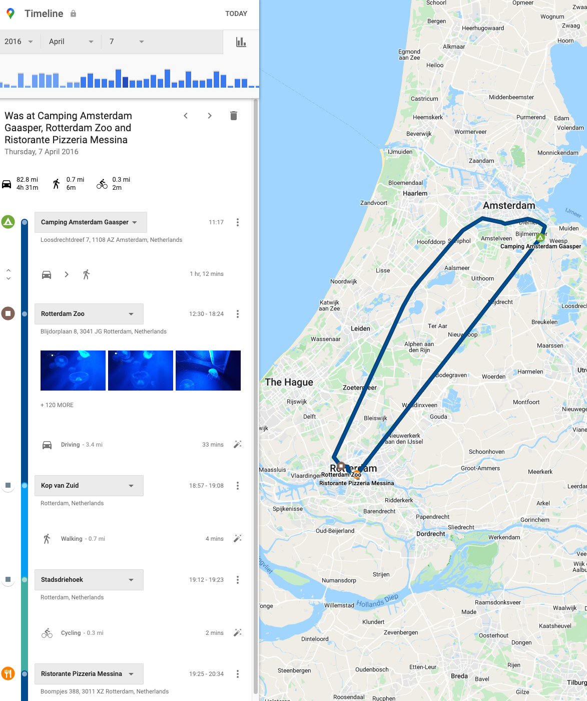
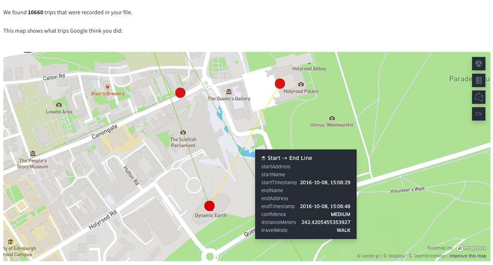

# Hestia.ai outreach

[Hestia.ai](https://www.hestia.ai/en/about) are experts on data access and the flows and usages of personal data in today's world. We are keen to connect with investigative journalists and others attending [the Dataharvest event](https://dataharvest.eu/) to show you the **powerful tools and techniques** you can use to investigate the digital landscape.

## A demonstration:  Does Google know you are at Dataharvest?

| | |
|--|--|
|
 A trail of nearby wi-fi hotspots, tracked by Google and viewable in [Hestia.ai’s interface](https://digipower.hestialabs.org/google).
|<strong>Even without my geolocation activated</strong>, Google knows I'm at Dataharvest. |
|We can explain to you how to use Google tracking and data access to <strong>do journalism in a new way</strong>.|
 We show how Google ranks the probability of nearby  venues to determine which venue you visited.
|
| | |

### Step 1: A quick check on your Google Timeline

Google provides all its users with a web interface where you view any past location data they have recorded from you on a map. You can view it at [timeline.google.com](https://timeline.google.com/). **Don't forget to come back here afterwards and find out more in Step 2!**.

<ul><li><strong>Visit <a href='https://timeline.google.com'>timeline.google.com</a></strong> - Google will show a map and timeline of any location data it has ever recorded for you, right up to the present moment.</li></ul>
 

The map shows a red dot for each point that's been tracked, it looks something like this:

You can click on a red dot to find out what it is, and pan and zoom just like on Google Maps. You can use the calendar controls on the top left to filter the map to only show a certain month or year. You can also drill down on a particular day. This will give you a timeline for the day, which looks something like this. This shows how Google has translated the locations you have visited into specific venues, and your journeys into specific modes of transport, something like this: 

<ul><li><strong>Try selecting today's date</strong> - the data is collected and shown in near-real-time so you should see where Google thinks you are right now, or have been in the last few hours.</li></ul>
 

It's possible you might see a message suggesting Google has no location data on you. But don't give up. We can dig deeper and potentially find more, whether you saw any dots on the map or not. 

### Step 2: Explore what's in your Google Location History data behind the scenes 

In this stage, we're going to use the raw data that Google makes available via its Takeout tool to see if we can uncover some more details of how and where Google has tracked you.

[Google Takeout](https://takeout.google.com) is a free data download service that covers all Google services including Android, YouTube, Google Home, Chrome, Search, Maps, Drive and a lot more. So, we have to be careful what we select or we'll end up downloading tens of gigabytes. For this step, we only care about **My Activity** data and **Location History** data. 

<!--  -->

First, <strong>use Takeout to download your data</strong> by following these steps carefully:
<ul>
	<li>Visit <a href='https://takeout.google.com'>takeout.google.com</a> - make sure to log in with the right account.</li>
	<li>Click "Deselect All" on the right.</li>
	<li>Scroll down to "Location History" and select it.</li>
	

	<li>Using the 'Multiple formats' button, check that all download formats you can change are set to JSON (as opposed to KML).</li>
	<li>Scroll down to "My Activity" (NOT "Access Log Activity" which is different) and select it.</li>
	

	<li>IMPORTANT: Click "Multiple Formats" and change HTML to JSON in the dropdown.</li>
	

	<li>You should have 2 of 50 products selected for download. Click the blue "Next Step" button at the bottom of the page.</li>
	<li>Click "Create Export"</li>
	<li>Visit <a href='https://takeout.google.com/takeout/downloads'>"Manage Your Exports"</a> after a few minutes or an hour. For a while it will say "Export in progress". Eventually a download button will appear (you may receive a notification about this but don't count on it).</li>
</ul>
 

If you've followed the steps in this green box above, you've now got a downloaded zip file containing your My Activity and Location History data. Now we're going to show you how to **view and explore it using our custom-built web application**. You'll drop your zip file into the website in your browser, but no data travels to our servers or the Internet. Everything is done locally.

Now, <strong>go to our Google Experience and load your data</strong> and see what it reveals:
<ul>
<li>Visit <a href='https://digipower.hestialabs.org/google#load-data'>digipower.hestialabs.org/google</a>.</li>
<li>Drop your downloaded Takeout download, called something like takeout-20220518T090211Z-001.zip, into the grey box in the centre of the page and wait for it to be loaded. If you have a large volume of data, this might take a minute or two.</li>
<li>There are lots of things to explore on different tabs. First, click on "Places Visited". You will see a map showing the venues (not just positions) that Google thinks you've been.</li>
<li>Scroll to your current location and see if Google knows where you are!</li>
<li>You can click on a point to get more information about when it was logged as well as Google's confidence that is has the right place ('locationConfidence') as a percentage.</li>
<li>Click to the 'Other Candidates' tab and zoom in on the same place. You can see how Google decided which venue was the right place by looking at the lines and clicking on the endpoints or the lines to see the probabilities of other places that were considered. The red dot shows the 'winning' location and the yellow dots are the rejected candidates.</li>

<li>Click to the 'Travels' tab and zoom in on your current location. You can see what Google has deduced about your journey today by clicking on the line between the two dots:</li>

<li>Click to the 'Wifi' tab. You will probably find that even if your location tracking was switched off, Google has still been collecting details of which wi-fi hotspots and routers you have been close to, and has deduced locations from that.</li>
</ul>

From this little adventure, we've given you a glimpse of what just one company can learn about you through data, without you even knowing. There's a lot more to discover. Feel free to explore the other tabs to see what else is in your Google data (start with 'My Activity').

If you would like to learn about how you can view data from other companies such as Facebook, Twitter, Netflix, Uber and Spotify, and many more, please get in touch via the channels below.

We also run data access workshops, corporate trainings, one on one consultations and more. We'd love to talk to you about how you can use data access and data viewing tools as an investigative tool to help with your journalistic investigations!

Thanks for visiting

Paul-Olivier Dehaye and the team at Hestia.ai

## Join the community

Whether you want help accessing your data, need expertise for an investigation, or would like to talk about training and workshops, we'd love to chat to you more. Come and say Hi to us, we're very friendly!

You can find us:

- [On Signal](https://signal.group/#CjQKIMcHxPUWtz3_m3-OPjLt_PaO2XUfvBqOBCUdq00mHjodEhDHri7O-DS9lNIL9YTdk0Mw)
- [On Telegram](https://t.me/+B0TSoynMW7dmMWM0)

Don't have Signal? Download it [here](https://signal.org/download/). 
Don't have Telegram? Download it [here](https://telegram.org/apps).
